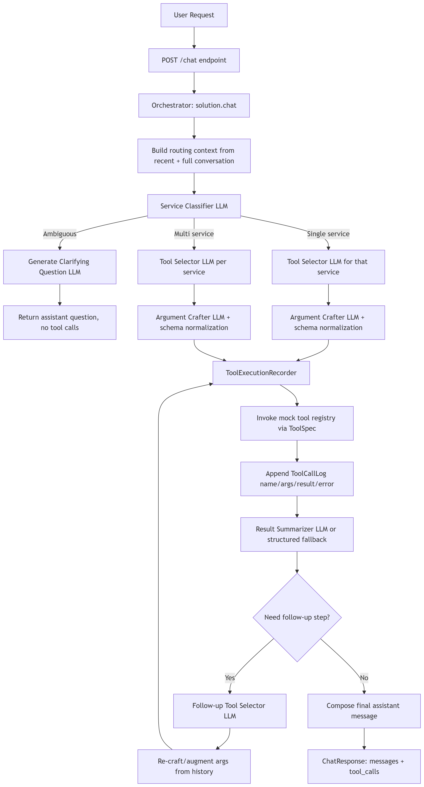

# Tool Call Orchestrator
## Project Introduction

The **Multi-Tool Chat Harness** is an AI-powered orchestration system designed to handle natural-language requests across a large ecosystem of connected services. The project provides a FastAPI backend with **191 mock tools spanning seven services**: Gmail, Google Calendar, Google Drive, Slack, Linear, GitHub, and Perplexity.

The core objective of the project is to build an intelligent chat layer that can understand a user's request, identify the tools required to complete it, execute those tools in the appropriate order, and return a clear and accurate response.

Rather than exposing all 191 tools to the language model at once, the system focuses on **intelligent tool routing**. For each user request, it determines which tools and services are relevant and provides the model with only the necessary capabilities. This reduces unnecessary context, improves tool-selection accuracy, and makes the system more scalable as the number of available tools grows.

The project also focuses heavily on **multi-step orchestration**. Many real-world requests require information to be retrieved from one service before an action can be performed in another. For example, a user might ask the system to find the latest email about a Q3 budget and then summarize it in a leadership Slack channel. Completing this request requires coordinating Gmail and Slack while preserving the dependency between the two operations.

The system is also designed to handle uncertainty and failure safely. When a request is ambiguous, such as asking to schedule a meeting with "everyone on the project" without specifying which project, the assistant should request clarification rather than make an assumption. Similarly, when a tool reports that a file does not exist or an operation fails, the assistant should communicate the failure instead of fabricating a successful outcome.

At the center of the project is the `POST /chat` endpoint. It accepts a conversation and produces an assistant response together with a complete record of the tools used during the interaction. This tool-call history makes the orchestration process observable and allows the evaluation system to verify that the correct tools were selected, invoked, and handled appropriately.

The project therefore combines three important capabilities:

* **Intelligent tool routing** across a large tool catalog
* **Multi-step orchestration** across dependent and independent tools
* **Reliable error and ambiguity handling** without inventing results

The resulting system acts as a general-purpose AI interface over multiple services, demonstrating how an LLM can move beyond simple question answering and instead coordinate real actions and information flows across a complex tool ecosystem.

The project is evaluated using a dedicated scenario-based harness covering single-service lookups, cross-service workflows, multi-step operations, ambiguous requests, error conditions, and state-changing actions. This provides a practical measure of how effectively the system can reason about tool selection and execute reliable workflows in a controlled environment.


A few example scenarios to anchor what kinds of prompts to expect:

> *"What conversations do I have in Slack?"*  — single tool, single service.
>
> *"Find the most recent email about the Q3 budget and post a summary to the leadership Slack channel."*  — cross-service: Gmail then Slack.
>
> *"Schedule a 30-minute meeting with everyone on the project next week."*  — ambiguous; you should ask which project.
>
> *"Delete the file 'budget_2025.xlsx' from my Drive."*  — file does not exist; explain rather than fabricate.


## Setup

Ensure you're in the candidate/ directory

```
pnpm install
cp .env.example .env   # add your OPENAI_API_KEY
pnpm run dev           # http://127.0.0.1:8000
pnpm --filter backend test
```

Quick sanity checks:

```
curl localhost:8000/tools | jq '.tools | length'   # -> 191
curl -X POST localhost:8000/reset                  # -> {"ok": true, "serviceCount": 7, "toolCount": 191}
curl -X POST localhost:8000/chat \
     -H 'content-type: application/json' \
     -d '{"messages":[{"role":"user","content":"hi"}]}'   # -> 501 until you implement it
```

## CLI

Once the backend is running, you can inspect responses and tool usage from the terminal:

```bash
pnpm run cli
pnpm run cli -- repl
pnpm run cli -- chat "What conversations do I have in Slack?"
pnpm run cli -- tools --service slack
pnpm run cli -- reset
pnpm run cli -- state
```

Inside the REPL, use `:help` to see commands. The most useful ones are `:tools`, `:reset`, `:state`, and `:raw`.

Run the evaluator yourself (after you've implemented `/chat`):

```
python -m evaluator.run                    # all scenarios
python -m evaluator.run --scenario s14     # one at a time while iterating
```

# Demo Video
link: https://www.loom.com/share/00c407b1550943dc925a4f1cf28166f5

# Tool-Routing Strategy
To reduce the number of tools exposed to the router, my pipeline first classifies the target service and then loads only that service’s tool definitions. For example, if the user wants to send an email, the router only loads Gmail tools. This reduces token usage significantly. I also split MCP documentation by service so only relevant docs are added to context after classification.

When a query arrives, the agent first determines whether it is single-service, multi-service, or ambiguous. If it is ambiguous, the system does not execute tools and instead asks a short clarifying question. If it is single-service or multi-service, the system checks whether the request is supported. If execution is appropriate, the agent selects a tool, crafts arguments, executes the call, and performs a small bounded follow-up loop only when needed. The loop stops when no next tool is required, when a call would repeat, or when the maximum step limit is reached.

tool-call errors are captured and logged, and then surfaced clearly to the user.

To improve grounding, I used separate system prompts for each subtask/agent. These constrained prompts increase consistency, reduce hallucination, and improve readability in final summaries (for example, prioritizing subject/body style outputs).
# Architecture


Problems I have faced: I wanted to have a initial capbility filter so that the system could save tokens by not executing impossible queries however the filter was too strict and easily stop the system from performing tasks. So I removed it from the systme.

## Modules description

| Module | Responsibility | Agent Role |
|---|---|---|
| common.py | Shared Service type and OpenAI client factory. | None |
| service_classifier.py | LLM routing classifier and clarifying-question generation. | Router agent |
| tool_catalog.py | Runtime and docs-based tool metadata/context builder. | None |
| tool_selector.py | LLM tool selection and follow-up step planning. | Tool planner agent |
| tool_given_service.py | Compatibility facade that re-exports tool-selector APIs. | None |
| argument_crafter.py | LLM argument generation with schema filtering and coercion. | Argument crafter agent |
| chat_execution.py | Tool execution, call logging, retry/argument augmentation, and assistant-part collection. | None (execution engine) |
| result_summarizer.py | LLM and fallback summarization of tool results. | Summarizer agent |
solution.py | Main chat orchestration loop and multi-step tool execution | Orchestrator agent.

# Next Steps
1) Test Cases to check if correct tools were called for benchmarking evaluation.
2) Rule based filtering for easy capabilities
5) Capability Guardrail Implementation
3) Implementing tree of thought would improve response quality but expensive but might call more accurately.
4) Stricter Argument validation in system prompt or rule to reduce the likelihood of the model making an error.
